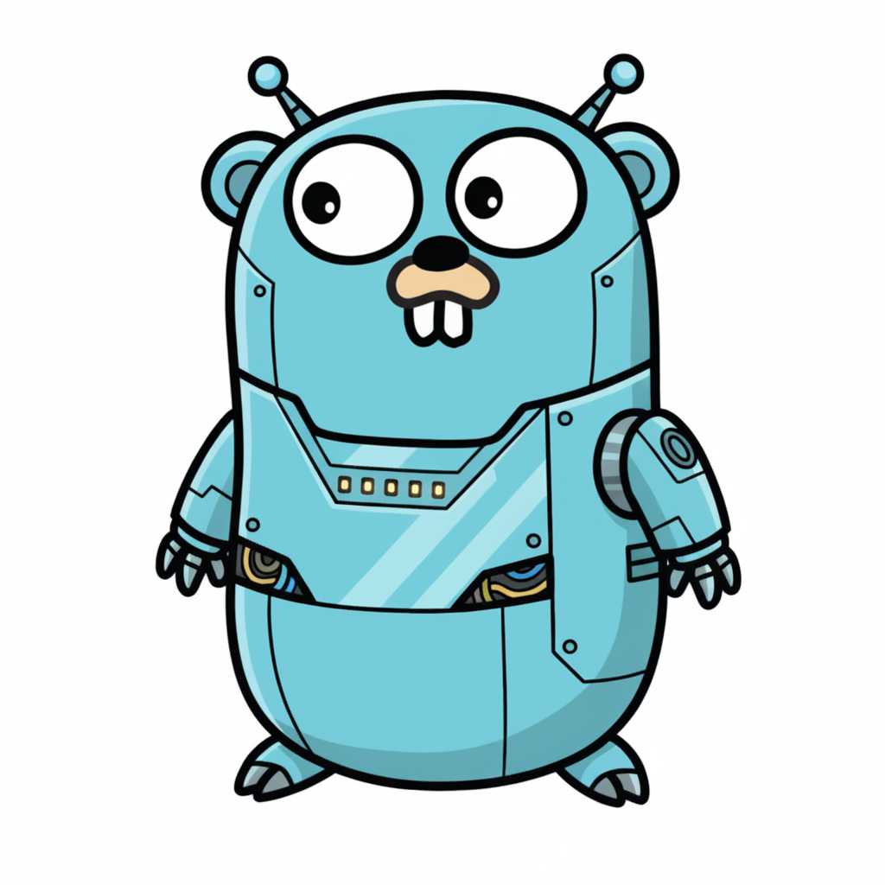

# Bergo - Bot Engineer in Golang



```
██████╗ ███████╗██████╗  ██████╗  ██████╗ 
██╔══██╗██╔════╝██╔══██╗██╔═══╗  ██╔═══██╗
██████╔╝█████╗  ██████╔╝██║ ████║██║   ██║       
██╔══██╗██╔══╝  ██╔══██╗██║   ██║██║   ██║
██████╔╝███████╗██║  ██║╚██████╔╝╚██████╔╝
╚═════╝ ╚══════╝╚═╝  ╚═╝ ╚═════╝  ╚═════╝ 
```

**Bergo** (Bot EngineeR in GO) 是一个基于 Golang 开发的命令行 AI Coding Agent，帮助开发者快速、高效地完成代码编写任务。

> 本项目主要代码由 AI 编写。同时没在 Windows 平台测试过，请最好不要在 Windows 平台使用。建议用linux/macos

## ✨ 特性

- **多模型支持** - 支持多种 LLM 提供商，不限定特定模型
- **开箱即用** - 丰富的预置配置，快速上手
- **CheckPoint 支持** - 代码检查点功能，随时回退代码变更
- **Agentic RAG** - 内置智能 RAG 能力
- **多模式支持** - ASK、PLANNER、AGENT 等多种工作模式
- **多语言支持** - 完整的国际化支持（中文/英文）
- **跨平台** - 支持 macOS、Linux、Windows (amd64/arm64)

## 🚀 快速开始

### 安装

```bash
# 克隆项目
git clone https://github.com/bergo-tools/Bergo.git
cd Bergo

# 安装依赖
go mod download

# 构建
make build
```

### 初始化配置

```bash
# 运行初始化向导
bergo init
```

向导会引导您完成：
1. 选择 AI 模型提供商
2. 输入 API 密钥
3. 选择主模型
4. 自动创建配置文件

### 运行

```bash
# 使用默认配置 (bergo.toml)
bergo

# 指定配置文件
bergo your-config.toml
```

## 📦 支持的模型提供商

| 提供商 | 推荐模型 | 说明 |
|--------|----------|------|
| **DeepSeek** | deepseek-chat, deepseek-reasoner | DeepSeek AI |
| **MiniMax** | minimax-m2 | MiniMax AI |
| **Kimi** | kimi-k2, kimi-k2-thinking | Moonshot AI |
| **Xiaomi** | mimo-v2-flash | 小米 AI |
| **OpenAI** | gpt-4o, gpt-4-turbo | OpenAI GPT 系列 |
| **Anthropic** | claude-3-5-sonnet | Claude 系列 |
| **OpenRouter** | 多种模型 | 第三方模型平台 |

## ⚙️ 配置文件

项目使用 `bergo.toml` 配置文件，位于工作目录下。首次运行时会自动引导创建。

### 基本配置项

| 配置项 | 类型 | 默认值 | 说明 |
|--------|------|--------|------|
| `debug` | bool | `false` | 是否开启调试模式 |
| `language` | string | `"chinese"` | 界面语言 |
| `line_budget` | int | `1000` | 读取文件时的最大行数限制 |
| `compact_threshold` | float | `0.8` | 上下文压缩阈值（0-1），超过此比例时触发压缩 |
| `max_session_count` | int | `0` | 最大会话保存数量，0表示不限制 |
| `http_proxy` | string | - | HTTP代理地址 |

### 模型选择配置

| 配置项 | 说明 |
|--------|------|
| `main_model` | 主模型标识符，用于Agent对话 |
| `berag_model` | berag工具使用的模型（默认同main_model） |
| `berag_extract_model` | berag提取内容使用的模型（默认同main_model） |

### API 密钥配置

支持以下服务商的快捷密钥配置：

```toml
deepseek_api_key = "sk-xxx"
openai_api_key = "sk-xxx"
minimax_api_key = "xxx"
kimi_api_key = "xxx"
xiaomi_api_key = "xxx"
openrouter_api_key = "sk-xxx"
```

### 自定义模型配置

通过 `[[models]]` 添加自定义模型：

```toml
[[models]]
identifier = "my-model"          # 模型标识符，用于 main_model 等引用
provider = "openai"              # 服务商: openai/anthropic/deepseek/minimax/kimi/xiaomi/openrouter
model_name = "gpt-4o"            # 实际模型名称
api_key = "sk-xxx"               # API密钥（可选，会覆盖全局密钥）
base_url = "https://api.xxx.com" # 自定义API地址（可选）
support_vision = true            # 是否支持视觉,可否使用图片

# 模型参数（可选）
temperature = 0.7                # 温度参数
top_p = 1.0                      # Top-P采样
max_tokens = 8192                # 最大输出token数
context_window = 128000          # 上下文窗口大小（推荐填写）

# 高级配置（可选）
frequency_penalty = 0.0          # 频率惩罚
presence_penalty = 0.0           # 存在惩罚
price_per_mil_token = 0.0        # 每百万token价格（用于成本统计）
rate_limit_interval = 0        # 请求间隔限制（秒），防止API限流
think = false                    # 是否启用思考模式
prefill = false                  # 是否启用预填充
```

### 配置示例

```toml
# 基本配置
debug = false
language = "chinese"
line_budget = 1000

# 使用 deepseek 作为主模型
main_model = "deepseek-chat"
deepseek_api_key = "sk-your-key"

# 添加自定义模型
[[models]]
identifier = "claude"
provider = "anthropic"
model_name = "claude-sonnet-4-20250514"
api_key = "sk-ant-xxx"
context_window = 200000
```

完整配置示例参见 [example_config.toml](./example_config.toml)

## 💻 命令参考

### 系统命令
| 命令 | 说明 |
|------|------|
| `/exit` | 退出程序 |
| `/help` | 显示帮助信息 |
| `/clear` | 清除当前会话 |
| `/sessions` | 加载历史会话 |

### 模式切换
| 命令 | 说明 |
|------|------|
| `/view` | 切换到 VIEW 模式 |
| `/planner` | 切换到 PLANNER 模式 |
| `/agent` | 切换到 AGENT 模式 |
| `/multiline` | 启用多行输入模式 |

### 功能命令
| 命令 | 说明 |
|------|------|
| `/history` | 查看操作时间线 |
| `/revert` | 回退到上个存档点 |
| `/model` | 切换模型 |
| `/compact` | 压缩上下文 |

## 📎 使用 @ 符号添加上下文

Bergo 支持使用 `@` 符号将文件添加为对话上下文：

```bash
# 添加单个文件
请帮我分析这个文件 @file:main.go

# 添加整个目录
请帮我重构这个模块 @file:utils/
```

- 输入 `@file:` 后可触发自动补全
- 支持添加多个文件
- 文件路径中不能包含空格


## 🌍 多语言设置

### 界面语言
```bash
# 通过环境变量设置
export BERGO_LANG=zh
bergo

# 或直接运行
BERGO_LANG=zh bergo
```

### LLM 回复语言
在配置文件中设置 `language` 字段：
```toml
language = "chinese"  # 或 "english" 默认中文
```

## 📁 项目结构

```
bergo/
├── agent/          # Agent 核心逻辑
├── berio/          # 输入输出处理
├── config/         # 配置管理
├── llm/            # LLM 提供商实现
├── locales/        # 国际化
├── prompt/         # 提示词模板
├── tools/          # 工具集
├── utils/          # 工具函数
├── version/        # 版本管理
├── wizard/         # 初始化向导
├── main.go         # 程序入口
└── Makefile        # 构建脚本
```

## 🔧 开发指南

### 添加新的 LLM 提供商

1. 在 `llm/` 目录下创建新的提供商文件
2. 实现 `LLMProvider` 接口
3. 在配置文件中添加相应配置

### 自定义工具

1. 在 `tools/` 目录下创建新工具文件
2. 实现相应的接口
3. 在 agent 中注册新工具

### 跨平台构建

```bash
# 构建当前平台
make build

# 构建所有平台
make cross

# 构建特定平台
make darwin    # macOS
make linux     # Linux
make windows   # Windows
```

## 📝 Memento 文件

Bergo 会在工作目录下维护 `.bergo.memento` 文件，用于在长时间对话中保持上下文记忆。该文件在 Bergo 工作时会短暂出现。

## 🛠️ 技术栈

- **Go 1.25** - 主要开发语言
- **Bubble Tea** - 现代终端 UI 框架
- **pterm** - 终端美化输出

## 📄 许可证

本项目采用 [Apache License 2.0](LICENSE) 许可证。

## 🤝 贡献

欢迎提交 Issue 和 Pull Request！

---

**Bergo** - AI-Powered Coding Agent 🚀
